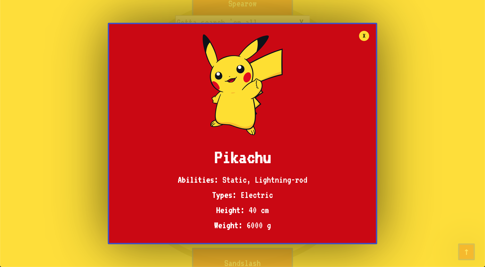

# Pokédex

This is a little, fully responsive application that fetches data about Pokémon from the RESTful <a href="https://pokeapi.co/">PokéAPI</a> and then displays it in a searchable list. Have fun.

<a href="https://hannesdonel.github.io/Pokedex/">Use the app.</a>

## Technologies

- HTML
- CSS
- JavaScript
- parcel
- eslint
- stylelint

## Functionality

- Load data from an external API
- View a list of items
- On user action (e.g., by clicking on a list item), view details for that item
- Search through all items with a search input

## Get started

You can start a development server on `http://localhost:1234/` via `npm run dev`.
